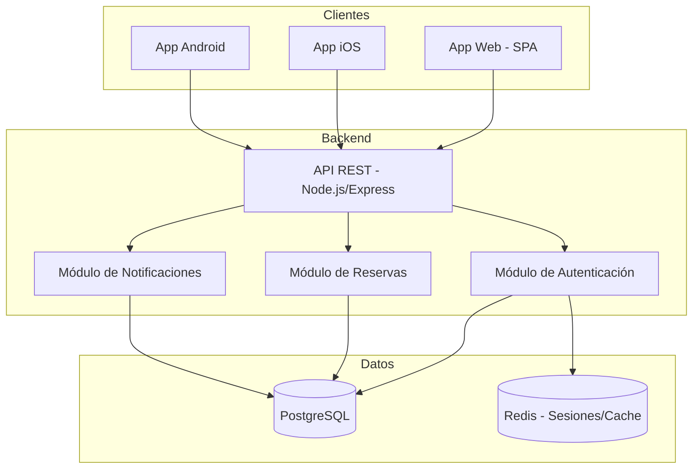
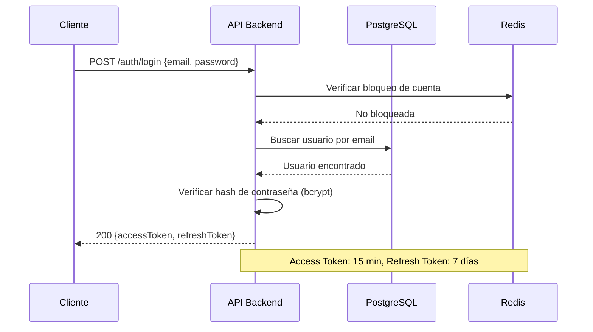
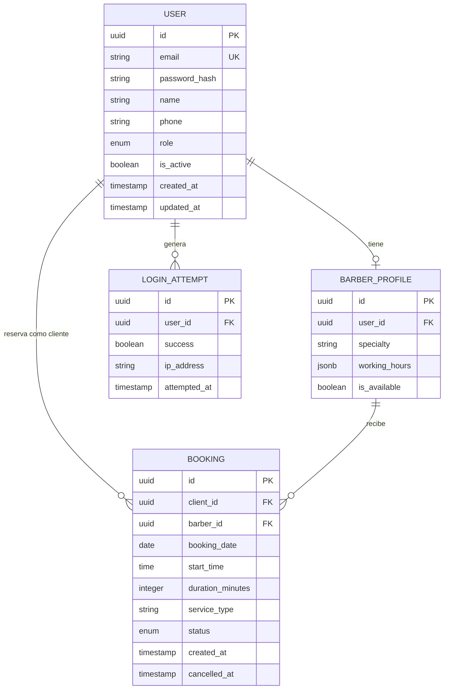

# Documento de Diseño: Barbershop Booking

## Overview

Este documento describe el diseño técnico del sistema de reservas para barbería. El sistema permite a los clientes registrarse, autenticarse y reservar turnos de 30 minutos con barberos específicos. Los barberos tienen acceso de solo lectura a su agenda diaria. Un administrador gestiona las cuentas de barberos.

La arquitectura sigue un patrón cliente-servidor con una API REST centralizada que sirve a tres clientes: aplicación web (SPA), aplicación iOS y aplicación Android. La autenticación se basa en JWT con control de roles (cliente, barbero, administrador).

## Architecture

### Diagrama de Arquitectura General



### Decisiones Arquitectónicas

| Decisión | Elección | Justificación |
|----------|----------|---------------|
| Backend Runtime | Node.js + Express | Ecosistema maduro para APIs REST, buen rendimiento para I/O |
| Base de datos | PostgreSQL | Soporte robusto para transacciones, integridad referencial, tipos de fecha/hora |
| Cache/Sesiones | Redis | Manejo eficiente de sesiones, bloqueo de cuentas, TTL nativo |
| Autenticación | JWT + Refresh Token | Stateless, compatible con múltiples clientes |
| Frontend Web | React + TypeScript | Ecosistema amplio, tipado estático, reutilización de componentes |
| Mobile | React Native | Código compartido entre iOS y Android, acceso a APIs nativas |
| Validación | Zod (backend) | Validación de esquemas con inferencia de tipos TypeScript |

### Flujo de Autenticación



## Components and Interfaces

### Módulo de Autenticación (AuthModule)

**Responsabilidad:** Registro, login, gestión de sesiones, control de intentos fallidos.

```typescript
interface AuthService {
  register(data: RegisterDTO): Promise<AuthResponse>;
  login(data: LoginDTO): Promise<AuthResponse>;
  refreshToken(token: string): Promise<AuthResponse>;
  logout(userId: string): Promise<void>;
}

interface RegisterDTO {
  email: string;       // RFC 5322, max 254 chars
  password: string;    // min 8 chars, 1 mayúscula, 1 minúscula, 1 número
  name: string;
  phone?: string;
}

interface LoginDTO {
  email: string;
  password: string;
}

interface AuthResponse {
  accessToken: string;
  refreshToken: string;
  user: UserProfile;
}
```

### Módulo de Reservas (BookingModule)

**Responsabilidad:** Creación, consulta, cancelación de turnos. Validación de disponibilidad y conflictos.

```typescript
interface BookingService {
  createBooking(data: CreateBookingDTO, clientId: string): Promise<Booking>;
  cancelBooking(bookingId: string, clientId: string): Promise<void>;
  getAvailability(barberId: string, date: string): Promise<TimeSlot[]>;
  getClientBookings(clientId: string): Promise<Booking[]>;
  getBarberAgenda(barberId: string, date: string): Promise<AgendaEntry[]>;
}

interface CreateBookingDTO {
  barberId: string;
  date: string;        // ISO 8601 date (YYYY-MM-DD)
  startTime: string;   // HH:mm formato 24h
  serviceType: string;
}

interface TimeSlot {
  startTime: string;
  endTime: string;
  available: boolean;
}

interface AgendaEntry {
  bookingId: string;
  clientName: string;
  startTime: string;
  duration: number;    // minutos
  serviceType: string;
  status: BookingStatus;
}
```

### Módulo de Notificaciones (NotificationModule)

**Responsabilidad:** Envío de confirmaciones y alertas a clientes.

```typescript
interface NotificationService {
  notifyBookingConfirmation(booking: Booking): Promise<void>;
  notifyBookingCancellation(booking: Booking): Promise<void>;
}
```

### API REST - Endpoints

| Método | Ruta | Rol | Descripción |
|--------|------|-----|-------------|
| POST | /auth/register | Público | Registro de cliente |
| POST | /auth/login | Público | Inicio de sesión |
| POST | /auth/refresh | Autenticado | Renovar token |
| POST | /auth/logout | Autenticado | Cerrar sesión |
| GET | /bookings | Cliente | Listar turnos del cliente |
| POST | /bookings | Cliente | Crear turno |
| DELETE | /bookings/:id | Cliente | Cancelar turno |
| GET | /availability/:barberId | Cliente | Consultar disponibilidad |
| GET | /barber/agenda | Barbero | Ver agenda del día |
| GET | /barber/agenda/:date | Barbero | Ver agenda por fecha |
| POST | /admin/barbers | Admin | Crear cuenta de barbero |
| GET | /admin/barbers | Admin | Listar barberos |

### Middleware de Autorización

```typescript
interface AuthMiddleware {
  authenticate(req: Request): Promise<DecodedToken>;
  authorize(...roles: Role[]): Middleware;
  rateLimitLogin(req: Request): Promise<boolean>;
}

type Role = 'client' | 'barber' | 'admin';
```

## Data Models

### Diagrama Entidad-Relación



### Esquema de Base de Datos

```sql
CREATE TYPE user_role AS ENUM ('client', 'barber', 'admin');
CREATE TYPE booking_status AS ENUM ('confirmed', 'cancelled', 'completed');

CREATE TABLE users (
    id UUID PRIMARY KEY DEFAULT gen_random_uuid(),
    email VARCHAR(254) UNIQUE NOT NULL,
    password_hash VARCHAR(255) NOT NULL,
    name VARCHAR(100) NOT NULL,
    phone VARCHAR(20),
    role user_role NOT NULL DEFAULT 'client',
    is_active BOOLEAN NOT NULL DEFAULT true,
    created_at TIMESTAMP WITH TIME ZONE DEFAULT NOW(),
    updated_at TIMESTAMP WITH TIME ZONE DEFAULT NOW()
);

CREATE TABLE barber_profiles (
    id UUID PRIMARY KEY DEFAULT gen_random_uuid(),
    user_id UUID UNIQUE NOT NULL REFERENCES users(id),
    specialty VARCHAR(100),
    working_hours JSONB NOT NULL DEFAULT '{"mon":{"start":"09:00","end":"18:00"},"tue":{"start":"09:00","end":"18:00"},"wed":{"start":"09:00","end":"18:00"},"thu":{"start":"09:00","end":"18:00"},"fri":{"start":"09:00","end":"18:00"},"sat":{"start":"09:00","end":"14:00"}}',
    is_available BOOLEAN NOT NULL DEFAULT true
);

CREATE TABLE bookings (
    id UUID PRIMARY KEY DEFAULT gen_random_uuid(),
    client_id UUID NOT NULL REFERENCES users(id),
    barber_id UUID NOT NULL REFERENCES barber_profiles(id),
    booking_date DATE NOT NULL,
    start_time TIME NOT NULL,
    duration_minutes INTEGER NOT NULL DEFAULT 30,
    service_type VARCHAR(50) NOT NULL,
    status booking_status NOT NULL DEFAULT 'confirmed',
    created_at TIMESTAMP WITH TIME ZONE DEFAULT NOW(),
    cancelled_at TIMESTAMP WITH TIME ZONE,
    CONSTRAINT valid_duration CHECK (duration_minutes > 0),
    CONSTRAINT future_booking CHECK (booking_date >= CURRENT_DATE)
);

CREATE TABLE login_attempts (
    id UUID PRIMARY KEY DEFAULT gen_random_uuid(),
    user_id UUID REFERENCES users(id),
    email VARCHAR(254) NOT NULL,
    success BOOLEAN NOT NULL,
    ip_address INET,
    attempted_at TIMESTAMP WITH TIME ZONE DEFAULT NOW()
);

-- Índices para rendimiento
CREATE INDEX idx_bookings_barber_date ON bookings(barber_id, booking_date) WHERE status = 'confirmed';
CREATE INDEX idx_bookings_client ON bookings(client_id) WHERE status = 'confirmed';
CREATE INDEX idx_login_attempts_user ON login_attempts(user_id, attempted_at);
CREATE UNIQUE INDEX idx_users_email ON users(email);
```

### Estructura working_hours (JSONB)

```json
{
  "mon": { "start": "09:00", "end": "18:00" },
  "tue": { "start": "09:00", "end": "18:00" },
  "wed": { "start": "09:00", "end": "18:00" },
  "thu": { "start": "09:00", "end": "18:00" },
  "fri": { "start": "09:00", "end": "18:00" },
  "sat": { "start": "09:00", "end": "14:00" },
  "sun": null
}
```

### Estructura de Respuesta JSON (API)

```typescript
// Respuesta exitosa
interface SuccessResponse<T> {
  success: true;
  data: T;
}

// Respuesta de error
interface ErrorResponse {
  success: false;
  error: {
    code: string;
    message: string;
    details?: Record<string, string[]>;
  };
}
```


## Correctness Properties

*Una propiedad es una característica o comportamiento que debe mantenerse verdadero en todas las ejecuciones válidas de un sistema — esencialmente, una declaración formal sobre lo que el sistema debe hacer. Las propiedades sirven como puente entre especificaciones legibles por humanos y garantías de correctitud verificables por máquinas.*

### Property 1: Validación de email y contraseña

*Para cualquier* cadena de texto, la función de validación de registro debe aceptar la entrada si y solo si el email cumple con RFC 5322 (máximo 254 caracteres) y la contraseña tiene al menos 8 caracteres con al menos una mayúscula, una minúscula y un número. Cualquier entrada que no cumpla estos criterios debe ser rechazada.

**Validates: Requirements 1.1, 1.6**

### Property 2: Bloqueo de cuenta por intentos fallidos consecutivos

*Para cualquier* secuencia de intentos de login para un usuario dado, la cuenta debe bloquearse si y solo si hay 5 o más intentos fallidos consecutivos. Un intento exitoso debe reiniciar el contador de fallos a cero.

**Validates: Requirements 1.5, 2.3**

### Property 3: Cálculo de disponibilidad

*Para cualquier* barbero con un horario laboral definido y un conjunto de turnos confirmados en una fecha dada, los bloques de disponibilidad retornados deben: (a) estar todos dentro del horario laboral del barbero, (b) ser bloques de exactamente 30 minutos, (c) no solaparse con ningún turno confirmado existente, y (d) cubrir todos los bloques posibles que cumplan (a), (b) y (c).

**Validates: Requirements 3.2**

### Property 4: No solapamiento de turnos por barbero

*Para cualquier* barbero y fecha, no deben existir dos turnos confirmados cuyo rango de tiempo [start_time, start_time + duration) se solape. Si se intenta crear un turno que se solapa con uno existente del mismo barbero, la operación debe ser rechazada.

**Validates: Requirements 3.3**

### Property 5: No solapamiento de turnos por cliente

*Para cualquier* cliente y fecha, no deben existir dos turnos confirmados del mismo cliente cuyo rango de tiempo se solape. Si se intenta crear un turno que se solapa con otro turno existente del mismo cliente, la operación debe ser rechazada.

**Validates: Requirements 3.4**

### Property 6: Máximo de turnos activos por cliente

*Para cualquier* cliente, el número de turnos con estado "confirmed" nunca debe exceder 3. Cualquier intento de crear un cuarto turno activo debe ser rechazado.

**Validates: Requirements 3.5**

### Property 7: Regla de tiempo para cancelación

*Para cualquier* turno confirmado, la cancelación debe ser exitosa si y solo si la hora actual es al menos 2 horas antes de la hora programada del turno. Si la diferencia es menor a 2 horas, la cancelación debe ser rechazada.

**Validates: Requirements 4.1, 4.4**

### Property 8: Cancelación restringida al propietario

*Para cualquier* par (cliente, turno) donde el turno no pertenece al cliente, el intento de cancelación debe ser rechazado sin modificar el estado del turno.

**Validates: Requirements 4.6**

### Property 9: Completitud de datos en la agenda

*Para cualquier* turno confirmado en la agenda de un barbero, la respuesta debe incluir: nombre del cliente, hora de inicio, duración del servicio y tipo de servicio solicitado.

**Validates: Requirements 5.2**

### Property 10: Ordenamiento cronológico de la agenda

*Para cualquier* conjunto de turnos retornados en la agenda de un barbero, los turnos deben estar ordenados de forma ascendente por hora de inicio. Para todo par consecutivo (turno_i, turno_i+1), se debe cumplir que turno_i.start_time <= turno_i+1.start_time.

**Validates: Requirements 5.3**

### Property 11: Barbero restringido a solo lectura

*Para cualquier* usuario con rol "barber", cualquier solicitud de creación, modificación o eliminación de turnos a través de la API debe ser rechazada con un error de autorización (403). Solo las operaciones de lectura de su propia agenda deben ser permitidas.

**Validates: Requirements 2.4, 6.2**

### Property 12: Aislamiento de datos del barbero

*Para cualquier* barbero autenticado que consulta la agenda, los resultados deben contener exclusivamente turnos asignados a ese barbero. Ningún turno de otro barbero debe aparecer en la respuesta.

**Validates: Requirements 6.3**

### Property 13: Validación de token de autenticación

*Para cualquier* solicitud a un endpoint protegido, la solicitud debe ser aceptada si y solo si contiene un token JWT válido (firma correcta, no expirado, correspondiente a un usuario registrado activo). Solicitudes sin token o con token inválido deben recibir respuesta 401.

**Validates: Requirements 8.2, 8.3**

### Property 14: Autorización basada en roles

*Para cualquier* combinación de (usuario, endpoint, método HTTP), si el rol del usuario no tiene permiso para acceder a ese recurso, la solicitud debe ser rechazada con código 403 independientemente de la validez de los datos enviados.

**Validates: Requirements 8.4**

### Property 15: Validación de entrada retorna 400

*Para cualquier* solicitud con datos de entrada que no cumplen las reglas de validación del endpoint (campos obligatorios ausentes, tipos incorrectos, valores fuera de rango), la API debe retornar código 400 con un cuerpo que indique los campos con error.

**Validates: Requirements 8.5**

### Property 16: Estructura consistente de respuesta JSON

*Para cualquier* respuesta de la API (exitosa o fallida), el cuerpo debe seguir la estructura definida: un campo `success` (boolean) y, si es exitosa, un campo `data` con los datos; si es error, un campo `error` con `code`, `message` y opcionalmente `details`.

**Validates: Requirements 8.7**

## Error Handling

### Estrategia General

El sistema implementa un manejo de errores en capas:

1. **Capa de Validación (400):** Zod valida los datos de entrada antes de llegar a la lógica de negocio. Los errores de validación se transforman en respuestas estructuradas con detalle por campo.

2. **Capa de Autenticación (401):** El middleware de autenticación intercepta solicitudes sin token válido antes de que lleguen a los controladores.

3. **Capa de Autorización (403):** El middleware de autorización verifica que el rol del usuario tenga permiso para el recurso solicitado.

4. **Capa de Negocio (409/422):** Errores de lógica de negocio como conflictos de horario, límite de turnos alcanzado, o violación de reglas de cancelación.

5. **Capa de Infraestructura (500/503):** Errores inesperados del servidor, fallos de conexión a base de datos, o servicios no disponibles.

### Códigos de Error Específicos

| Código HTTP | Código de Error | Descripción |
|-------------|----------------|-------------|
| 400 | VALIDATION_ERROR | Datos de entrada inválidos |
| 401 | TOKEN_MISSING | No se proporcionó token |
| 401 | TOKEN_EXPIRED | Token expirado |
| 401 | TOKEN_INVALID | Token con firma inválida |
| 401 | INVALID_CREDENTIALS | Email o contraseña incorrectos |
| 403 | INSUFFICIENT_PERMISSIONS | Rol sin permisos para el recurso |
| 403 | ACCOUNT_LOCKED | Cuenta bloqueada por intentos fallidos |
| 404 | BOOKING_NOT_FOUND | Turno no encontrado o no pertenece al usuario |
| 409 | SLOT_UNAVAILABLE | Horario ya ocupado por otro turno |
| 409 | CLIENT_OVERLAP | Cliente ya tiene turno en ese horario |
| 422 | MAX_BOOKINGS_REACHED | Cliente alcanzó el máximo de 3 turnos activos |
| 422 | CANCELLATION_TOO_LATE | Cancelación con menos de 2 horas de anticipación |
| 422 | BOOKING_ALREADY_CANCELLED | Turno ya fue cancelado previamente |
| 422 | BOOKING_ALREADY_COMPLETED | Turno ya fue completado |
| 500 | INTERNAL_ERROR | Error interno del servidor |
| 503 | SERVICE_UNAVAILABLE | Servicio temporalmente no disponible |

### Manejo de Concurrencia

Para evitar condiciones de carrera en la reserva de turnos (dos clientes intentando reservar el mismo slot simultáneamente):

```sql
-- Uso de bloqueo a nivel de fila con SELECT FOR UPDATE
BEGIN;
SELECT * FROM bookings 
WHERE barber_id = $1 
  AND booking_date = $2 
  AND start_time = $3 
  AND status = 'confirmed'
FOR UPDATE;

-- Si no hay conflicto, insertar
INSERT INTO bookings (...) VALUES (...);
COMMIT;
```

Alternativamente, se puede usar un constraint UNIQUE parcial:

```sql
CREATE UNIQUE INDEX idx_no_overlap_barber 
ON bookings (barber_id, booking_date, start_time) 
WHERE status = 'confirmed';
```

### Reintentos y Resiliencia

- Conexiones a base de datos: pool con reintentos automáticos (máximo 3 intentos, backoff exponencial)
- Notificaciones: cola de reintentos con dead-letter queue para fallos persistentes
- Sincronización cross-platform: reintento automático hasta 3 veces con intervalo de 2 segundos

## Testing Strategy

### Enfoque Dual de Testing

El sistema utiliza dos enfoques complementarios:

1. **Tests unitarios (example-based):** Verifican escenarios específicos, casos borde y condiciones de error con datos concretos.
2. **Tests de propiedades (property-based):** Verifican propiedades universales que deben cumplirse para todas las entradas válidas.

### Librería de Property-Based Testing

- **Librería:** [fast-check](https://github.com/dubzzz/fast-check) para TypeScript/Node.js
- **Configuración:** Mínimo 100 iteraciones por test de propiedad
- **Etiquetado:** Cada test referencia la propiedad del documento de diseño

```typescript
// Ejemplo de configuración
fc.assert(
  fc.property(
    fc.emailAddress(), 
    fc.string({ minLength: 8 }),
    (email, password) => {
      // Feature: barbershop-booking, Property 1: Validación de email y contraseña
      const result = validateRegistration({ email, password });
      // ... assertions
    }
  ),
  { numRuns: 100 }
);
```

### Distribución de Tests por Módulo

| Módulo | Tests Unitarios | Tests de Propiedad | Tests de Integración |
|--------|----------------|-------------------|---------------------|
| AuthModule | Login/logout flows, error messages | Props 1, 2, 13, 14 | Session management |
| BookingModule | CRUD operations, edge cases | Props 3, 4, 5, 6, 7, 8 | DB transactions |
| AgendaModule | Empty state, formatting | Props 9, 10, 12 | Real-time updates |
| API Layer | Endpoint existence, routing | Props 15, 16 | Performance (< 2s) |
| Authorization | Role checks | Prop 11 | Cross-role scenarios |

### Tests Unitarios (Example-Based)

Cubren los criterios clasificados como EXAMPLE y EDGE_CASE:
- Login exitoso con credenciales correctas (1.2, 2.1)
- Mensaje de error genérico sin revelar campo incorrecto (1.3, 2.2)
- Registro con email duplicado (1.4)
- Expiración de sesión por inactividad (2.6)
- Cancelación de turno ya cancelado (4.5)
- Confirmación y notificación post-cancelación (4.2)
- Estado vacío de agenda (5.4)
- UI de solo lectura del panel del barbero (6.1)
- Reintento de sincronización (7.4)

### Tests de Integración

Cubren los criterios clasificados como INTEGRATION y SMOKE:
- Actualización de agenda en tiempo real (5.5)
- Sincronización cross-platform en < 5 segundos (7.3)
- Compatibilidad con navegadores (7.1)
- Disponibilidad en iOS/Android (7.2)
- Existencia de todos los endpoints (8.1)
- Tiempo de respuesta < 2 segundos (8.6)

### Estructura de Archivos de Test

```
tests/
├── unit/
│   ├── auth/
│   │   ├── register.test.ts
│   │   ├── login.test.ts
│   │   └── session.test.ts
│   ├── booking/
│   │   ├── create-booking.test.ts
│   │   ├── cancel-booking.test.ts
│   │   └── availability.test.ts
│   └── agenda/
│       └── barber-agenda.test.ts
├── property/
│   ├── validation.property.test.ts      (Props 1, 15, 16)
│   ├── auth.property.test.ts            (Props 2, 13, 14)
│   ├── booking.property.test.ts         (Props 3, 4, 5, 6)
│   ├── cancellation.property.test.ts    (Props 7, 8)
│   ├── agenda.property.test.ts          (Props 9, 10, 12)
│   └── authorization.property.test.ts   (Prop 11)
├── integration/
│   ├── api-endpoints.test.ts
│   ├── real-time-updates.test.ts
│   └── performance.test.ts
└── e2e/
    ├── client-booking-flow.test.ts
    └── barber-agenda-flow.test.ts
```
